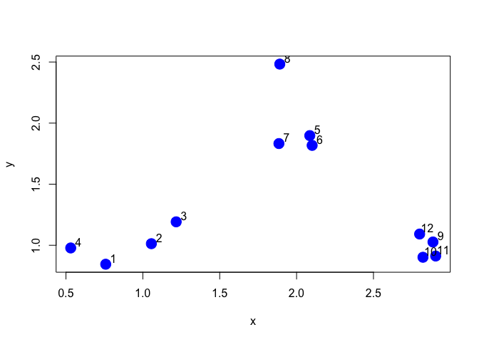
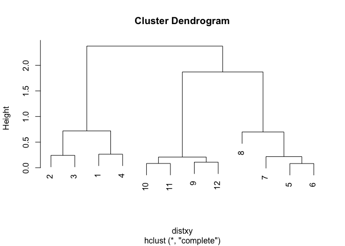
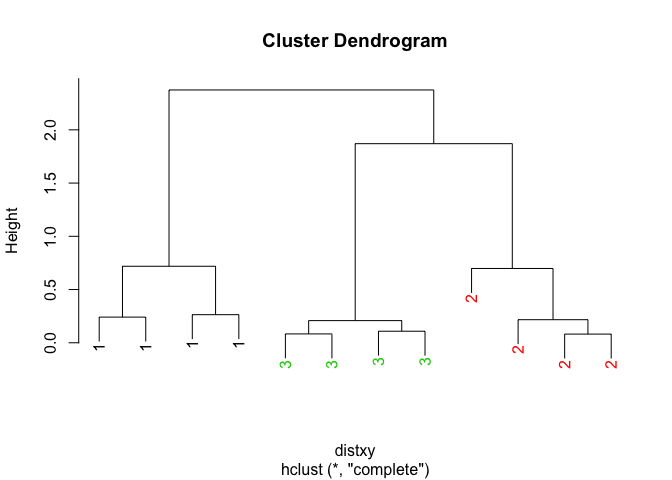
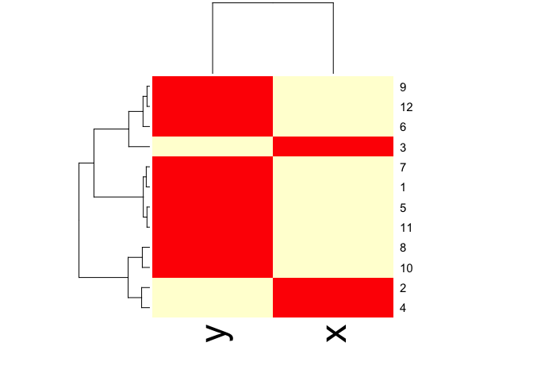

# Clustering
Jose V. Die  
23 de agosto de 2015  
### HIERARCHICAL CLUSTERING
It is a very useful technique for looking at high dimensional data and organize data
in a logical and intuitive way.  

#### Simulated Data

```r
set.seed(1234)
#par(mar = c(0,0,0,0))
x  <- rnorm(12,mean=rep(1:3, each = 4), sd = 0.2)
y  <- rnorm(12, mean=rep(c(1,2,1), each = 4), sd = 0.2)
plot(x,y,col="blue", pch = 19, cex=2)
text(x + 0.05, y + 0.05, labels = as.character(1:12))
```

 
* First, you need to calculate all the pair-wise distances. To Calculate distance 
between all possible points:  
    ## dist()  
    ## hclust()    
  

```r
dataFrame  <- data.frame(x=x, y=y)
distxy  <- dist(dataFrame) #it gives "distance matrix"
hClustering  <- hclust(distxy)
plot(hClustering)
```

 
  
It does not really tell you how many clusters there are. It depends on where you 
set the threshold.

  
Prettier dendograms:

```r
myplclust <- function( hclust, lab=hclust$labels, lab.col=rep(1,length(hclust$labels)), hang=0.1,...){
  ## modifiction of plclust for plotting hclust objects *in colour*!
  ## Copyright Eva KF Chan 2009
  ## Arguments:
  ##    hclust:    hclust object
  ##    lab:        a character vector of labels of the leaves of the tree
  ##    lab.col:    colour for the labels; NA=default device foreground colour
  ##    hang:     as in hclust & plclust
  ## Side effect:
  ##    A display of hierarchical cluster with coloured leaf labels.
  y <- rep(hclust$height,2); x <- as.numeric(hclust$merge)
  y <- y[which(x<0)]; x <- x[which(x<0)]; x <- abs(x)
  y <- y[order(x)]; x <- x[order(x)]
  plot( hclust, labels=FALSE, hang=hang, ... )
  text( x=x, y=y[hclust$order]-(max(hclust$height)*hang),
        labels=lab[hclust$order], col=lab.col[hclust$order], 
        srt=90, adj=c(1,0.5), xpd=NA, ... )
}

myplclust(hClustering, lab = rep(1:3, each = 4), lab.col = rep(1:3, each = 4))
```

 

#### Visualizing matrix data : heatmap() function

heatmap() runs a hierarchical cluster on the rows of the table (ex., observations) 
and on the columns of the table (ex., set of observations).

```r
dateFrame  <- data.frame(x = x, y = y)
set.seed(143)
dataMatrix  <- as.matrix(dataFrame)[sample(1:12),]
heatmap(dataMatrix)
```

 

### K-MEANS CLUSTERING

