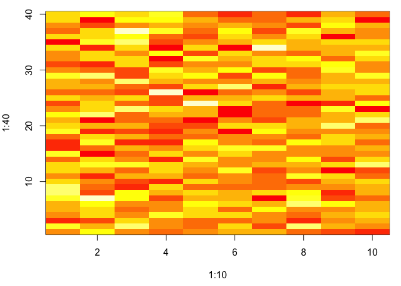
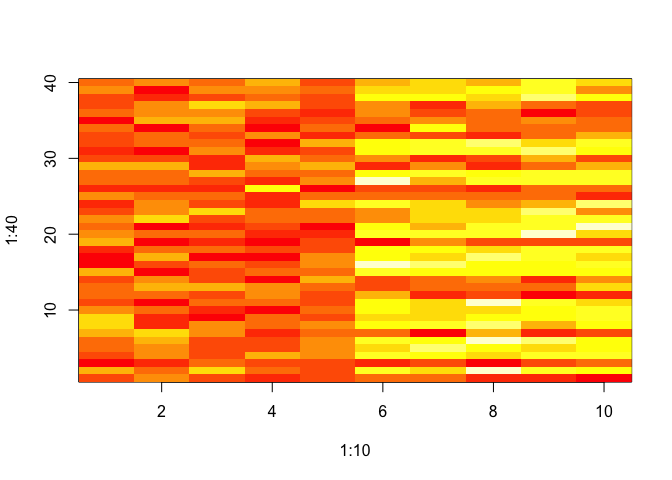
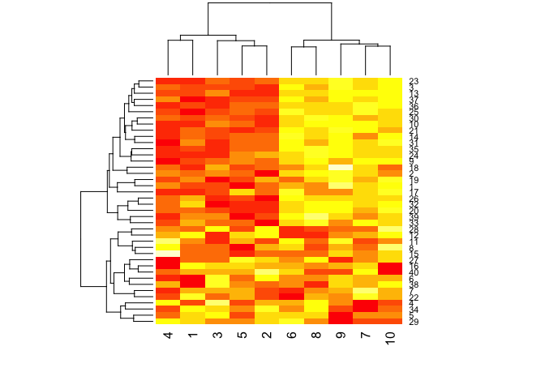
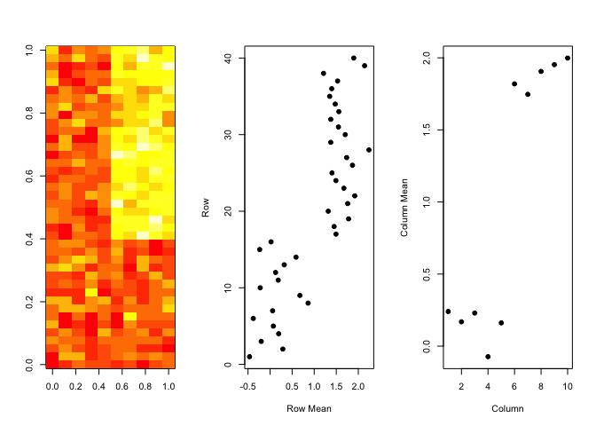
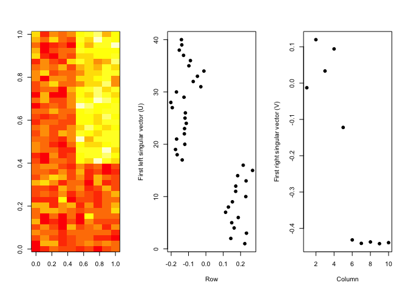
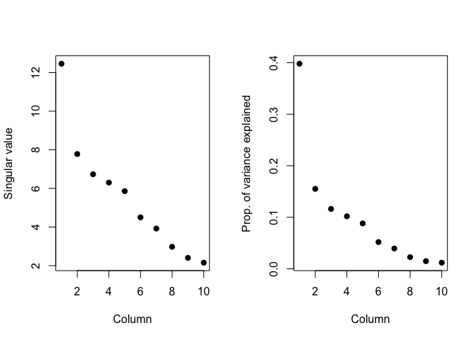

# Principal Components Analysis and Singular Value Decomposition
Jose V. Die  
1 de mayo de 2016  

Principal Components Analysis and Singular Value Decomposition

Simulate some random normal data

```r
set.seed(12345)
my.parmar = par()$mar #to further restore default values default
par(mar=c(4.5,4,1,1))
dataMatrix <- matrix(rnorm(400), nrow = 40)
image(1:10, 1:40, t(dataMatrix)[, nrow(dataMatrix):1])
```

 

```r
par(my.parmar)   #restore default values
```

```
## NULL
```

I can run some hierarchical clustering analysis on this: 

```r
heatmap(dataMatrix)
```

 
There is not really interesting pattern on it.  

**What if we add a pattern?**

```r
set.seed(678910)
for (i in 1:40) {
    # flip a coin
    coinFlip <- rbinom(1, size = 1, prob = 0.5)
    # if coin is heads add a common pattern to that row
    if (coinFlip) {
        dataMatrix[i, ] <- dataMatrix[i, ] + rep(c(0, 3), each = 5)
    }
}
```
The data: 

```r
image(1:10, 1:40, t(dataMatrix)[, nrow(dataMatrix):1])
```

 

The clustered data:

```r
heatmap(dataMatrix)
```

 
Closer look at the patterns of the rows and the columns by looking at the marginal means
of the rows and columns. Ex. 10 different column means or 40 different colum means...  

**Patterns in rows and columns:**

```r
hh <- hclust(dist(dataMatrix))
dataMatrixOrdered <- dataMatrix[hh$order, ]
par(mfrow = c(1, 3))

## Complete data
image(t(dataMatrixOrdered)[, nrow(dataMatrixOrdered):1])

## Show the row means
plot(rowMeans(dataMatrixOrdered), 40:1, , xlab = "Row Mean", ylab = "Row", pch = 19)

## Show the column means
plot(colMeans(dataMatrixOrdered), xlab = "Column", ylab = "Column Mean", pch = 19)
```

 
However, there may be other patterns beyond a simple mean shift and so more sophis- ticated methods will be needed. Futhermore, there may be multiple patterns layered on top of each other so we need a method that can distangle these patterns.  

If X is a matrix (with each variable in a columns and each observation in a row), 
**SVD** is a matrix decomposition that represents X as a matrix product of 3 matrices:  
    X=UDV'  
**Principal Component Analysis (PCA)** are equal to the right singular values if you first scale (subtract the mean, divide by the standard deviation) the variables.


```r
svd1 <- svd(scale(dataMatrixOrdered))
par(mfrow = c(1, 3))
image(t(dataMatrixOrdered)[, nrow(dataMatrixOrdered):1])
plot(svd1$u[, 1], 40:1, , xlab = "Row", ylab = "First left singular vector (U)", 
    pch = 19)
plot(svd1$v[, 1], xlab = "Column", ylab = "First right singular vector (V)", pch = 19)
```

 
The first left and right singular vectors pick up the mean shift in both the rows and columns of the matrix.  
U, results in clear separation of the mean of the rows  
V, results in clear separation of the mean of the columns  

Difference with the previous plot is that we knew that there was a pattern. With SVD you do not need to have any information and the analysis can pick up the difference.   

### SVD components: Variance explained
This comes in the singular values that are in the D matrix. Each value represents a % of the total variation in your dataset that is explained by thta particular component. 


```r
par(mfrow = c(1, 2))

## Raw singular values (uninterpretable scale)
plot(svd1$d, xlab = "Column", ylab = "Singular value", pch = 19)

## Complete data (proportion of the variance explained)
plot(svd1$d^2/sum(svd1$d^2), xlab = "Column", ylab = "Prop. of variance explained", 
    pch = 19)
```

 
In that example the 1st singular value (recall, captures kind of the shift in the mean between the rows and the columns) captures ~ 40% of the variation in your data. So, almost of the variation in your data, is explained by a single kind of singular value (or you can think as a single dimension). The remaining variation of the data is explained by the other components. 

### Relation to PCA

### Dealing with missing values
