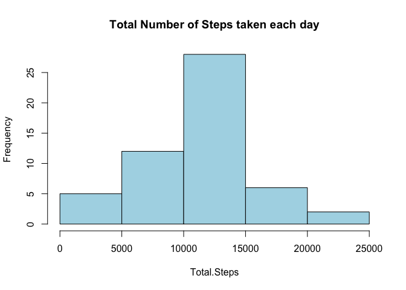
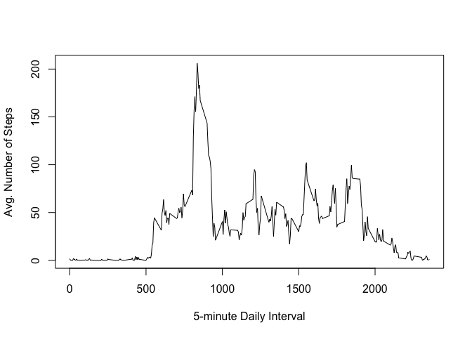
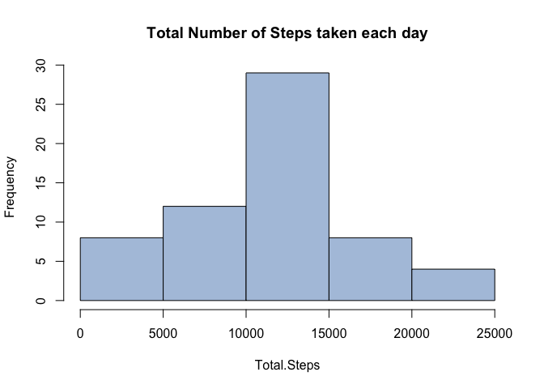
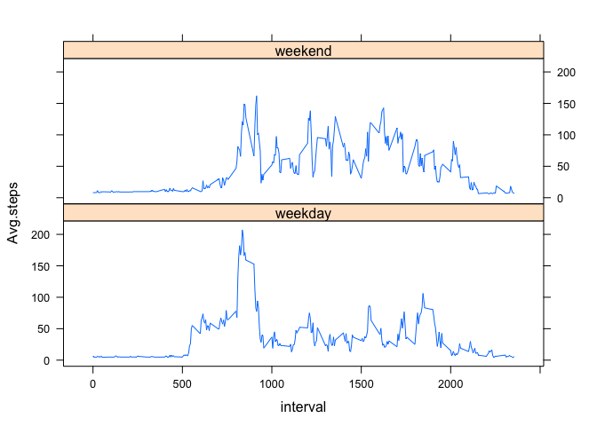

# Peer Assessment 1
Jose V. Die  
15 de septiembre de 2015  

### Dependencies
This document has the following dependencies:

```r
library(dplyr)
library(lattice)
```
  
  
Set the working directory and create a data directory if it does not exist.

```r
if(!file.exists(".data")){dir.create("./data")}
setwd("./data")
```
  
  
### Loading and preprocessing the data
Download zip file.

```r
fileUrl  <- "https://d396qusza40orc.cloudfront.net/repdata%2Fdata%2Factivity.zip"
download.file(fileUrl,destfile="./activity.zip", method="curl")
```

Unzip and Load data.    

```r
dat  <- read.csv(unz("activity.zip", 
       "activity.csv"),header=T, stringsAsFactors = TRUE)
```
  

What is mean total number of steps taken per day?
1.1 Calculate the total number of steps taken per day.

```r
steps.day  <- group_by(dat, date) %>%
        summarise(Total.Steps = sum(steps))
```
  
  
1.2 Make a histogram of the total number of steps taken each day.

```r
with(steps.day, hist(Total.Steps, main = "Total Number of Steps taken each day",
               col="lightblue"))
```

 
  
  
1.3 Calculate and **report** the mean and median of the total number of steps taken per day.

```r
report1  <- group_by(dat, date) %>%
        summarise(Total.Steps = sum(steps))
report1.mean   <- mean(report1$Total.Steps, na.rm=TRUE)
report1.median <- median(report1$Total.Steps, na.rm=TRUE)
```
**Report1:**
The mean of the total number of steps taken per day is 1.0766189\times 10^{4}
The median of the total number of steps taken per day is 10765  
  
  
### What is the average daily activity pattern?

2.1 Make a time series plot of the 5-minute interval and the average number of steps taken, averaged across all days.

```r
avg.day  <- group_by(dat, interval) %>%
  summarise(Avg.steps=mean(steps, na.rm=TRUE))
with(avg.day, plot(interval, Avg.steps, type="l", xlab="5-minute Daily Interval", ylab= "Avg. Number of Steps"))
```

 

2.2 Which 5-minute interval, contains the maximum number of steps?

```r
avg.day[which.max(avg.day$Avg.steps),]
```

```
## Source: local data frame [1 x 2]
## 
##   interval Avg.steps
##      (int)     (dbl)
## 1      835  206.1698
```
  

### Imputing missing values
3.1 Calculate and **report** the total number of missing values in the dataset (i.e. the total number of rows with NAs).


```r
report2 <- sum(is.na(dat$steps))
```
**Report2:**  
The total number of rows with NAs is 2304.

3.2 Devise a strategy for filling in all of the missing values in the dataset.   
Criteria: we fill in the missing values with the mean for that 5-minute interval averaged across all days. This value has been previously calculated and is asigned to the variable *avg.day*

First, we create an index of rows with NAs:


```r
ind  <- which(is.na(dat$steps))
```

3.3 Create a new dataset that is equal to the original dataset but with the missing data filled in.


```r
dat2 = dat
```

Fill in the data

```r
#vector containing the steps
y = dat2$steps
# vector containing ONLY the elements with NA 
y = dat2$steps[ind]
#vector containing average steps per day
z = avg.day$Avg.steps
#Note: in the dataframe there are 288 entries per day
#dat[288,]
#dat[289,]
#There are 17568 rows ==> there are data for 61 days (17568/288)
#vector containing average steps per day; each average 61 times
z = rep(avg.day$Avg.steps, each=61)
#vector containing average steps ONLY for those entries with NA in the original dataframe
z = z[ind]
#fill in the data
dat2$steps[ind]  <- z
```

3.4 Make a histogram of the total number of steps taken each day and calculate and *report* the mean and median total number of steps taken per day.

```r
steps.day.corrected <- group_by(dat2, date) %>%
        summarise(Total.Steps = sum(steps))
with(steps.day.corrected, hist(Total.Steps, main = "Total Number of Steps taken each day",
               col="lightsteelblue"))
```

 

```r
report3.mean <- mean(steps.day.corrected$Total.Steps)
report3.median <- median(steps.day.corrected$Total.Steps)
```
**Report 3:**  
The mean of the total number of steps taken per day is 1.0889799\times 10^{4}  
The median of the total number of steps taken per day is 1.1015\times 10^{4}

Do these values differ from the estimates from the first part of the assignment? What is the impact of imputing missing data on the estimates of the total daily number of steps?

```r
missing <- round(100 -(report1.median/report3.median*100),3)
```
By computing NA values, we miss 2.27% of the total number of steps

### Are there differences in activity patterns between weekdays and weekends?
Let's create a vector containing c("weekday", "weekend") in the proper order to be added in the dataframe.
We will have to start the vector with 'weekday'. We can check what day is the first day (and last day) in our dataframe: 

```r
weekdays(as.Date.factor(dat2$date))[1]
```

```
## [1] "lunes"
```

```r
weekdays(as.Date.factor(dat2$date))[17568]
```

```
## [1] "viernes"
```

We calculated above the number of days (61) and intervals per day (288). We create the vector replicating 'weekday'/'weekday' in the following way:  
- 1day (288 intervals) x 5 + 1day (288 intervals) x2 = 1 week  
- 1 week x 8 = 8 weeks  
We have to add 5 days:  
- 1day (288 intervals) x 5 (61days - 8weeks = 5 days)  


```r
week = c(rep(rep("weekday",288),5),rep(rep("weekend",288),2))
total.days = c(rep(week,8), rep(rep("weekday",288),5))
#Check the length of the vector
#length(total.days)
dat2$type.day = as.factor(total.days)
by.Day  <- group_by(dat2, interval,type.day) %>%
  summarise(Avg.steps=mean(steps, na.rm=TRUE))
xyplot(Avg.steps ~ interval | type.day, data=by.Day, layout =c(1,2), type="l")
```

 
